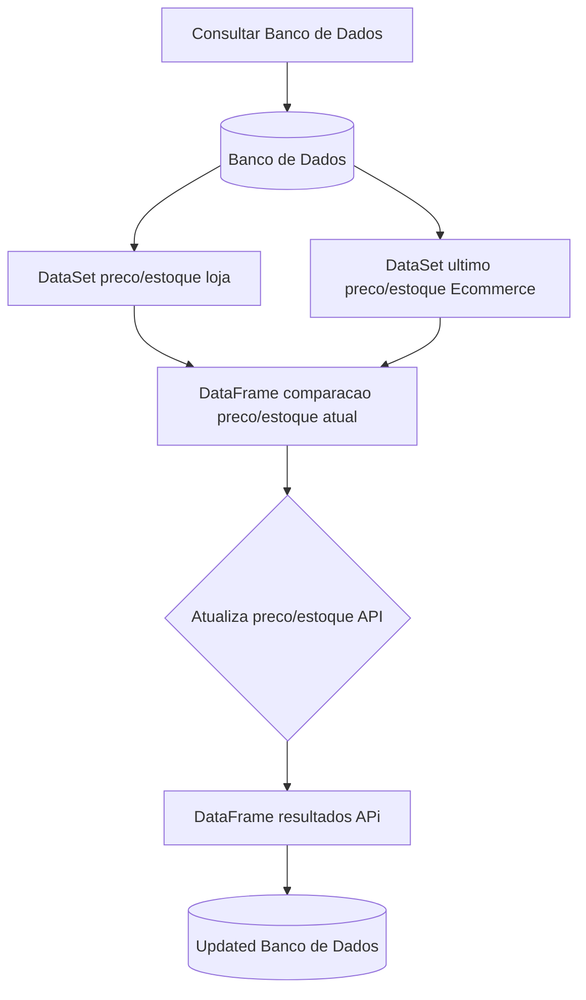
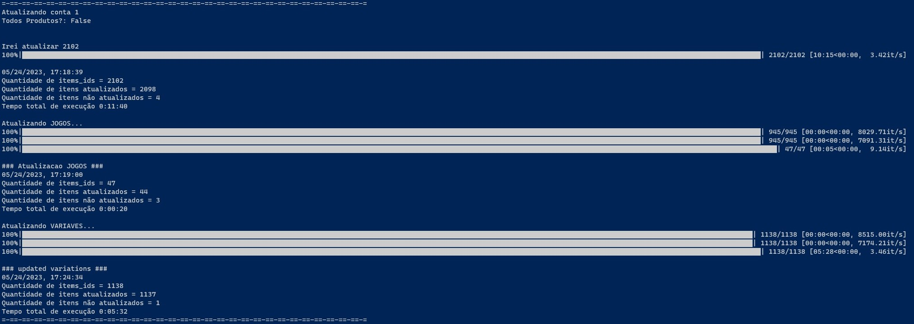

# Inventory Manager

## Índice 

* [Título e Imagem de capa](#Título-e-Imagem-de-capa)
* [Descrição do Projeto](#descrição-do-projeto)
* [Status do Projeto](#status-do-Projeto)
* [Funcionalidades e Demonstração da Aplicação](#funcionalidades-e-demonstração-da-aplicação)
* [Acesso ao Projeto](#acesso-ao-projeto)
* [Tecnologias utilizadas](#tecnologias-utilizadas)
* [Pessoas Desenvolvedoras do Projeto](#pessoas-desenvolvedoras)

## Descrição do projeto
O Invetory Manager (Gerente de estoque), tem o principal objetivo em atualizar preços e estoque de todos os produtos da loja KAIZENAUTOPECAS no Mercado livre. Também realiza manutenções de anúncios com outro projeto da organização da empresa, chamado WALL-E que também está no repositório inicial.

## Fluxograma :thread:

## Exemplo:

## :hammer: Funcionalidades do projeto

- `Funcionalidade 1`: Requisita todas as informações dos anúncios do Vendedor(Seller) MercadoLivre, via API.
- `Funcionalidade 2`: Consulta o preço e estoque atual da empresa. Via banco de dados, plataforma PostgreSQL.
- `Funcionalidade 2a`: Compara preço e estoque atual com o antigo, realizando as próximas requisições na API. Depois atualiza o banco de dados com as novas informações.
- `Funcionalidade 3`: Realiza reciclagem em anúncios muitos antigos.

## 📁 Acesso ao projeto
Você pode acessar os arquivos do projeto clicando [aqui](https://github.com/E-commerce-Pecista/manager_invetory/tree/main).

## ✔️ Técnicas e tecnologias utilizadas

- ``Python 3.11.3``
- Pandas
- Requests

## Autores

| [ Jeferson Lopes Reis](https://github.com/jef-loppes-reis) | [ Lucas Pereira Pires](https://github.com/l-pires) |
| :---: | :---: |
